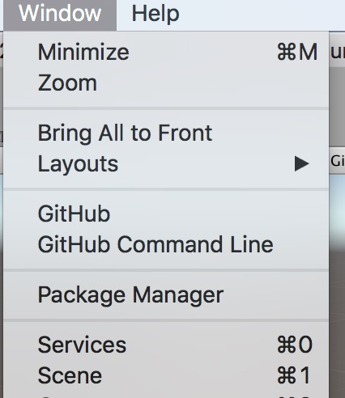
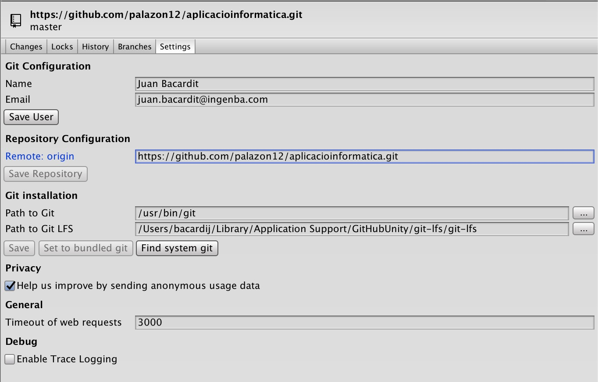
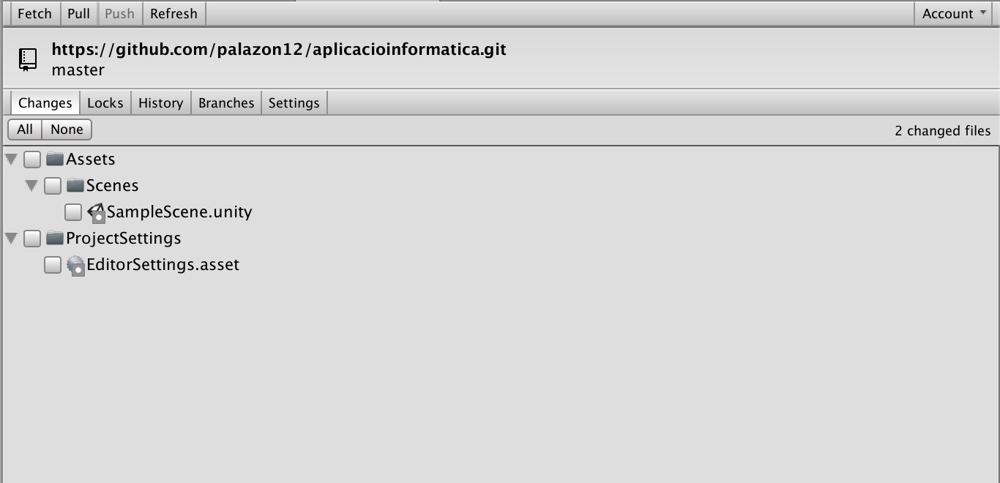

# GIT tutorial amb Unity

*Pas 1*: Descarregar l'adaptador de Github per unity desde https://unity.github.com/

*Pas 2:* Obrir la solució,d i executar amb doble click *.unitypackage*

*Pas 3:* A Unity Studio anar a Windows > Github

*Pas 4*: Al panell lateral configurar el usuari i connexió a github. 

*Pas 5:* Al canviar quelsevol cosa dins del projecte, s'ha de publicar els canvis al repositori. Per fer-ho, anar a la pestanya de *Changes*, seleccionar-los i publicar sobre repositori remot.

## GUIA GENERAL DE L'ADAPTADOR DE UNITY PER GITHUB:
https://github.com/github-for-unity/Unity/blob/master/README.md#github-for-unity

## GUIA GITHUB:
https://services.github.com/on-demand/downloads/github-git-cheat-sheet.pdf

